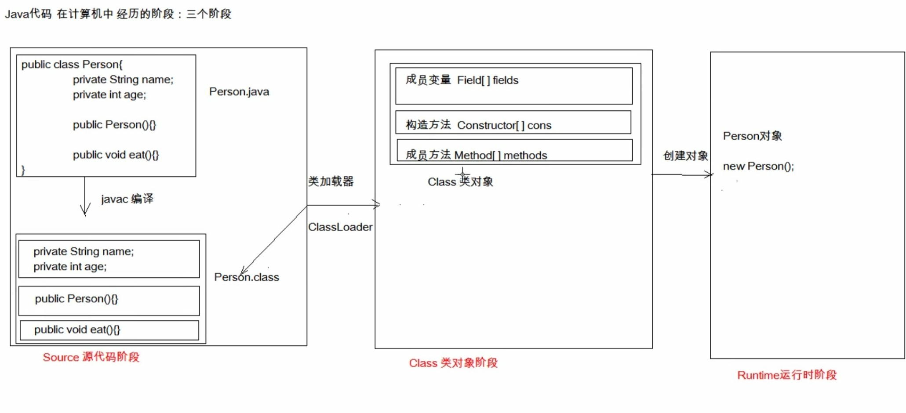

#	单元测试
	* 测试分类：
		1.黑盒测试：不需要写代码，提供输入，检查输出是否符合期望
		2.白盒测试：需要编写代码，关注程序的具体执行流程（junnit）

##	junit单元测试
	* 使用步骤：
		* 1. 定义一个测试类（测试用例）
			* 建议：
				* 测试类名：被测试类名Test
				* 包名：xxx.xxx.xxx.test
		* 2. 定义测试方法：可以独立运行
			* 建议：
				* 方法名：test测试的方法名 如testAdd()
				* 返回值：void，测试只用看结果即可，不需要返回值
				* 参数列表：建议空参
		* 3. 给方法加注解，即junit注解 @Test
		* 4.导入junit依赖
	* 判定结果
		* 红色：失败
		* 绿色：成功
		* 一般使用断言操作处理结果
			* Assert.assertEquals(expected,actual)
		

		* 补充
			* @Before
				* 被修饰的方法会在所有测试方法执行前自动执行
			* @After
				* 被修饰的方法会在所有测试方法结束后自动执行

#	反射
##	定义
把类的各个组成部分封装为其他对象(成员变量，构造方法，成员方法)


##IDEA提示原理

IDEA内部会把类的字节码文件加载进内存，在内存中有一个Class类对象，Class类对象里边已经把所有的方法抽取出来，封装为Method对象，然后把所有方法放到了Method数组里面。当需要提示的时候，只需要把数组成员加载在idea提示列表里即可。

	* 好处
		* 1 可以在程序运行过程中操作这些对象
		* 2 解耦，提高程序的可扩展性
##获取Class对象的方式
	* 方式	   
		* Class.forname("全类名") --包含包名，将字节码文件加载进内存，返回Class对象
			* 多用于配置文件中，将类名定义在配置文件中。读取文件，加载类
		* 类名.class --已经将字节码文件加载进内存，已有了Class对象的情况下使用
			* 多用于参数传递 
		* 对象.getClass --已有对象的情况下，该方法封装在Object类里面，所有对象都继承了该方法
			* 用于对象获取字节码 

	* 同一个字节码文件(*.class)在一次程序运行过程中，只会被加载一次，不论通过哪一种方式获取Class对象都是同一个。
	
	* Class对象功能
		* 获取成员变量
			* Field[] 	getFields() --获取所有public修饰的成员变量
			* Field 	getField(String name) --获取指定名称的public修饰的成员变量
			* Field[] 	getDeclareFields() --可获取private修饰的成员变量
			* Field 	getDeclareField(String name)
		* 获取构造方法
			* Constructor<?> getConstructors() 
			* Constructor<T> getConstructor(类<?>... parameterTypes)  
			* Constructor<T> getDeclaredConstructor(类<?>... parameterTypes) 
			* Constructor<?>[] getDeclaredConstructors()  
		* 获取成员方法 
			* Method 	getMethod(String name, 类<?>... parameterTypes)  
			* Method[] 	getMethods()  
			* Method 	getDeclaredMethod(String name, 类<?>... parameterTypes)  
			* Method[] 	getDeclaredMethods()  
		* 获取类名 
			* String 	getName()
			
	*  Field：成员变量
		* 操作：
			* 设置值 void 	set(Object obj, Object value) 
			* 获取值 Object 	get(Object obj)
			* 忽略访问权限修饰符的安全检查(暴力反射) setAccessible(true)
	* Constructor：构造方法
		* 创建对象：
			* T newInstance(Object... initargs)
			
			* 如果使用空参数构造方法获取对象。操作可以简化：Class对象的newInstance方法
	* Method：方法对象
		* 执行方法：
			* Object invoke(Object obj, Object ... args)
		* 获取方法名称：
			* String getName	

#	注解
	* 概念：用来说明程序。面向计算机。为JDK1.5引入的新特性。
	* 注释：用文字描述程序。面向程序员。
		* 如@Override，它会检查被该注解所标识的方法是否是重写了父类的方法，若不是则编译失败
	
	* JDK预定义注解 
		* @Override --它会检查被该注解所标识的方法是否是重写了父类的方法（接口），若不是则编译失败
		* @Deprecated --该注解标识的内容，表示已过时
		* @SuppressWarnings --压制警告，一般传递参数all

	* 自定义注解
		* 格式：
			* 元注解
			  public @interface 注解名称{}
		* 本质：接口
			* public interface 注解名称 extent java.lang.annotation.Annotation {}
		
		* 属性：接口中的抽象方法
			* 要求：
				* 属性的返回值类型 --基本数据类型，String，枚举，注解，以及相关的数组
				* 使用时需给属性赋值
					* 如果定义属性时，使用default关键字默认初始化值，则使用注解时，可以不进行属性的赋值
					* 如果只有一个属性需要赋值且属性的名称为value，则直接定义值，不需要写value
					* 数组赋值时，值使用{}包裹，若{}只有一个值，可以省略{}

		* 元注解：用于描述注解的注解
			* @Target --描述注解能够作用的位置(类or方法)
				* ElementType取值
					* TYPE --类
					* METHOD --方法
					* FIELD --成员变量 
			* @Retention --描述注解被保留的阶段
				* RetentionPolicy
					* RUNTIME --当前描述的注解保留到class字节码文件中，并被jvm读取(自定义比较常用)
					* CLASS --不会被jvm读取
					* SOURCE --不会保留到字节码中
			* @Documented --描述注解是否被抽取到API文档中
			* @Inherited --描述注解是否被子类继承，即子类会继承父类的注解
	* 解析注解：获取注解中定义的属性值	
		* 获取注解定义所在位置的对象 --Class,Method,Field等
		* 获取指定的注解
			* getAnnotation(Class)
		* 调用注解中的抽象方法获取配置的属性值	
	 其实就是在内存中生成了一个该注解接口的子类实例对象

```java
			
  public class ProImpl implements Pro{
      public String className(){return ""};
      public String methodName(){return ""};
  }
  
 ```	
	调用注解定义的抽象方法获取返回值，自定义注解里面全是抽象方法								