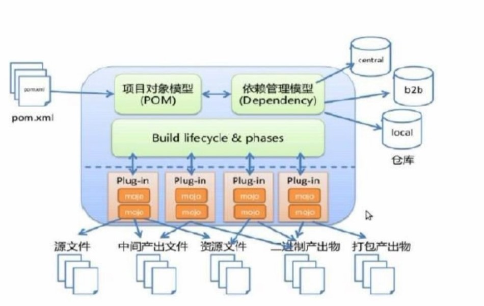

#	Maven

##	maven仓库概述

 maven工程中并不放置jar包，而是jar包的坐标
* 运行机制 当启动maven工程时，maven项目会通过本地jar包的坐标，去maven设置的仓库中寻找对应的jar包
* maven默认仓库路径 --localRepository| The path to the local repository maven will use to store artifacts.|| Default: ${user.home}/.m2/repository
* 本地仓库 --user.home表示系统盘用户目录，再次目录创建.m2文件夹，里面在创建repository，该仓库为本地仓库，如为新安装的maven，则该目录下不会有jar包
* 中央仓库 --若电脑联网，maven会找到中央仓库下载jar包，这里面放置了几乎所有开源的jar包
* 远程仓库 --公司为了不联网也可以开发，会再创建一个仓库--远程仓库(私服)，通过局域网即可访问，若远程仓库无所需jar包，则远程仓库会从中央仓库下载jar包，远程仓库的jar包部分也来源于本地仓库(上传)

##	maven标准目录结构

* 一个完整的项目可分为核心代码部分，配置文件部分，测试代码部分和测试配置文件部分。
	* 目录结构
	* src
		* main
			* java 		--核心代码部分
			* resources --配置文件部分
			* webapp	--页面资源，js，css，图片等（web工程才有）
		* test
			* java		--测试代码部分
			* resources --测试配置文件

##	maven常用命令

* mvn clean 	--删除target目录，删除编译好的项目
* mvn compile 	--生成target目录，里面将项目中src/main/java代码编译
* mvn test		--target目录生成，里面放置编译好了的src/test/java文件，此命令会编译正式项目的代码
* mvn package	--target目录生成，编译了测试代码和正式代码，并打包(.war)--默认
* mvn install	--target目录生成，编译测试和正式代码并打包，把包安装到本地仓库

##	maven生命周期

* maven一键构建	--核心功能之一
	* 清除项目编译信息(clean)-->编译(compile)-->测试(test)-->打包(package)-->安装(install)-->发布(deploy--执行此命令之前需要先进行配置)
		* clean为一个独立的生命周期--清理生命周期
		* 编译到发布为一个是默认生命周期，执行到后面的命令，会先走一遍前面的命令（主要）
		* 站点生命周期(用得不多)
	
##	maven概念模型图

* 项目对象模型(POM) --maven工程中的pom.xml文件，包含三类信息
	* 项目自身的信息
	* 项目运行所依赖的jar包信息
		* 独立出来一个模型叫依赖管理模型(Dependency) --放置的jar包的坐标
			* 包含内容 
				* 公司组织的名称 groupid
				* 项目名			artifactid
				* 版本号			version
			* 寻找jar包的仓库顺序 --local(本地仓库)-->b2b(远程仓库)-->central(中央仓库)
	* 项目运行环境信息（JDK,Tomcat...）
* 上述为maven第一个核心功能 --依赖管理 

* Build lifecycle & phases --构建生命周期
	* 每一个构建项目的命令都对应的maven底层的一个插件

* 最后两级即为maven第二个核心功能--一键构建

	
